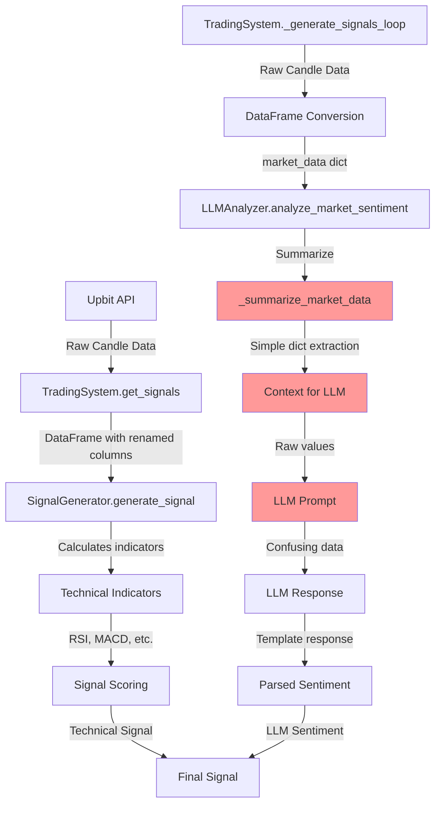
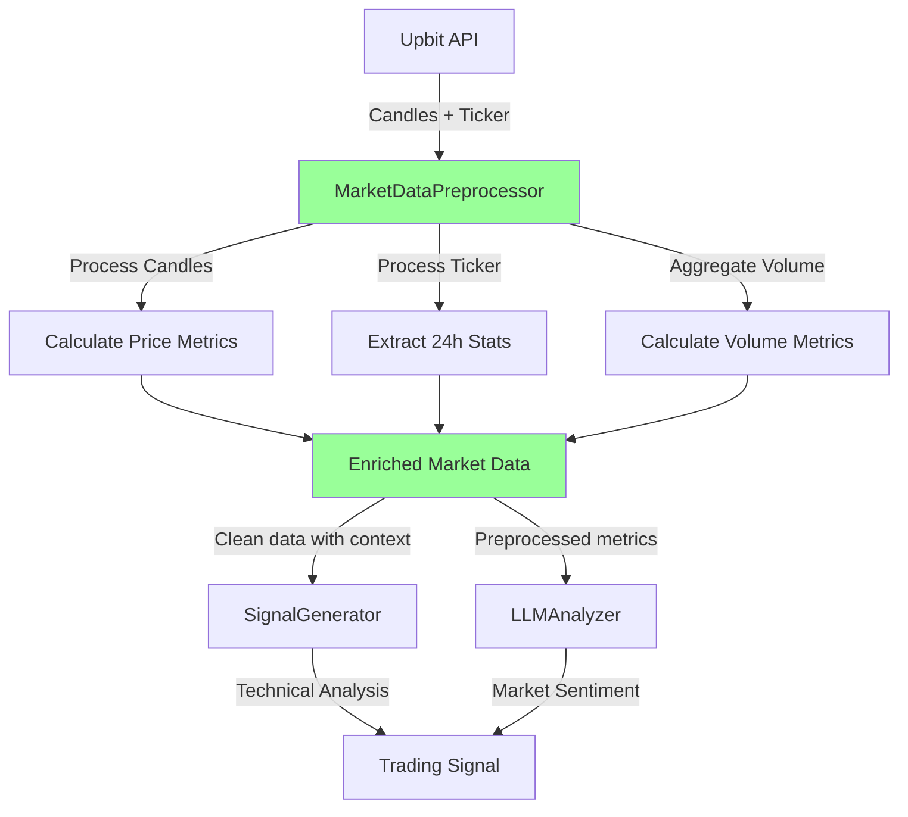

# Trading Bot Data Flow Analysis

## Current Data Flow (PROBLEMATIC)



## Problems Identified

### 1. **No Real Market Data Preprocessing**
```python
# Current _summarize_market_data (TOO SIMPLE!)
def _summarize_market_data(self, market_data: Dict) -> Dict:
    if not market_data:
        return {}
    
    summary = {
        "price_change_24h": market_data.get("price_change_24h", 0),  # Where does this come from?
        "volume_24h": market_data.get("volume_24h", 0),              # Not calculated!
        "current_price": market_data.get("current_price", 0),        # Not from candles!
    }
```

### 2. **Data Sources Mismatch**
- **Candle Data** has: `trade_price`, `opening_price`, `high_price`, `low_price`, `candle_acc_trade_volume`
- **LLM expects**: `price_change_24h`, `volume_24h`, `current_price`
- **Nobody calculates**: The actual 24h changes from candle data!

### 3. **Missing Ticker Data**
- We fetch candles but not current ticker info
- Ticker has the actual 24h change data
- Volume calculations are wrong

## Proposed Solution



## What MarketDataPreprocessor Should Do

1. **Fetch Complete Data**
   - Get candles for historical data
   - Get ticker for current 24h stats
   - Get orderbook for market depth (optional)

2. **Calculate Real Metrics**
   ```python
   {
       "current_price": 6337000.0,  # From latest candle or ticker
       "price_24h_ago": 6200000.0,  # From 24h old candle
       "price_change_24h": 2.21,     # Calculated percentage
       "price_change_amount": 137000, # Actual KRW change
       
       "high_24h": 6400000.0,        # From candles
       "low_24h": 6150000.0,         # From candles
       "volatility": 4.06,           # (high-low)/avg * 100
       
       "volume_24h_base": 1234.56,   # ETH volume
       "volume_24h_quote": 7821312000, # KRW volume
       "volume_average": 1000.0,     # Average from historical
       "volume_ratio": 1.23,          # Current vs average
       
       "trend_1h": "up",              # Last hour trend
       "trend_24h": "sideways",       # Day trend
       "support_level": 6200000,     # Calculated support
       "resistance_level": 6400000,   # Calculated resistance
   }
   ```

3. **Format for Different Consumers**
   - For LLM: Human-readable with percentages and context
   - For Signal Generator: Raw numerical values
   - For Frontend: Formatted with currency symbols

## Implementation Plan

### Step 1: Create MarketDataPreprocessor Service
```python
class MarketDataPreprocessor:
    def __init__(self, upbit_connector):
        self.upbit = upbit_connector
    
    async def get_enriched_market_data(self, market: str) -> Dict:
        # Fetch all data sources
        candles = self.upbit.get_candles(market, "minutes", 60, 24)
        ticker = self.upbit.get_ticker([market])
        
        # Calculate metrics
        processed_data = self._calculate_metrics(candles, ticker)
        
        return processed_data
```

### Step 2: Integrate into TradingSystem
- Replace direct candle fetching
- Use preprocessor for both signal generation and LLM

### Step 3: Update LLMAnalyzer
- Remove confusing _summarize_market_data
- Use preprocessed data directly
- Format properly in prompts

## Benefits

1. **Accurate Data**: Real 24h changes, not made-up values
2. **Consistent**: Same metrics everywhere
3. **LLM-Friendly**: Preprocessed, contextualized data
4. **Extensible**: Easy to add new metrics
5. **Testable**: Separate preprocessing logic